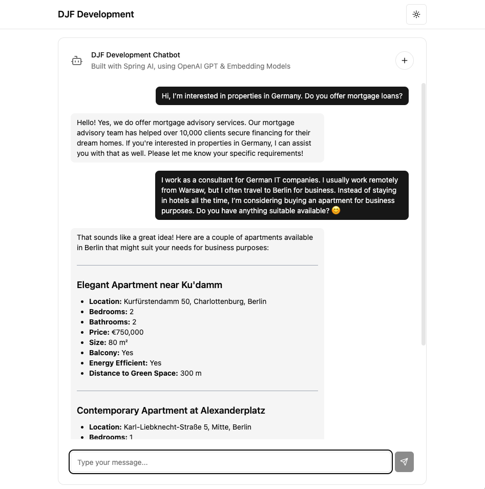

# spring-ai-rag

A Retrieval-Augmented Generation (RAG) Spring Boot application built using Spring AI and integrated with the OpenAI API.

It serves as a **virtual real estate assistant** capable of answering frequently asked questions (FAQs) based on company domain knowledge, searching real estate listings by filtering criteria such as location, price range, and number of bedrooms, and maintaining conversation history to provide context-aware follow-up responses.



## Features

- **Retrieval-Augmented Generation (RAG)**: Enriches AI-generated responses by dynamically retrieving context from structured data stored in PostgreSQL with pgvector for embeddings.
- **Chat History Memory**: Maintains a conversation history to provide context-aware replies in multi-turn conversations. The application uses in-memory chat memory for the sake of simplicity—for production-ready systems, it should be changed to a persistent memory store (Spring AI currently supports only Apache Cassandra)
- **OpenAI Integration**: Leverages the Spring AI library to connect with OpenAI GPT models for text generation and embedding creation.
- **Function Calling Support**: Demonstrates OpenAI function calling to trigger SQL queries on a relational database and return structured responses.
- **RESTful API Design**: Provides chat and conversation history retrieval endpoints, ready for frontend chatbot integration.
- **Hexagonal Architecture**: Adopts ports and adapters for modularity, extensibility, and testability.

## Flow

1.	**User Query** – The user submits a question or request.
2.	**Vector Search** – The query is vectorized and matched against stored embeddings in PostgreSQL (pgvector) to find relevant context.
3.	**Context Enrichment** – Retrieved context is appended to the query and sent to OpenAI GPT for response generation.
4.	**Function Calling** (Optional) – GPT can trigger database queries (e.g., property searches) via function calls to fetch real-time data, which is added to the final response.
5.	**Response** – GPT combines the query, context, and function results to produce a context-aware answer.

## Local Run

Export your OpenAI API secret key as an environment variable:

```shell
export SPRING_AI_OPENAI_API_KEY=<INSERT KEY HERE>
```

Run a local PostgreSQL instance using Docker Compose, serving as both a vector store and a relational database:

```shell
docker compose up -d
```

Run the backend application (defaults to port 8080):

```shell
./gradlew bootRun
```

Install dependencies and start the Vite development server (defaults to port 5173):

```shell
cd frontend && yarn && yarn dev
```

When using the Vite dev server, API calls are proxied to localhost:8080 by default.

## Production Build

Build the backend and frontend in a single step:

```shell
./gradlew build
```

Frontend assets are served directly by Spring Boot from the frontend JAR on the classpath.
Spring Boot resolves these files automatically using its default behavior for classpath:/static/.
API calls in production use the same origin (/), eliminating proxy configurations.

Access the FE application at `http://localhost:8080/`.

## REST API

### Chat Endpoint

`POST /api/chat`
Generates a response based on user input.  

#### Request Body
```json
{
  "conversationId": "1447eadc-6c64-481b-aee3-b90ab5c1ef2f",
  "message": "I'm looking for an apartment in Warsaw with two bedrooms under 1 million PLN."
}
```

#### Response Body
- **200 OK**

```json
{
  "message": "Here are some apartments in Warsaw with two bedrooms under 1 million PLN:\n\n1. Apartment in Mokotów – 850,000 PLN, 2 bedrooms, 70 m².\n2. Apartment in Wola – 950,000 PLN, 2 bedrooms, 80 m².\n\nWould you like more details about any of these listings?"
}
```

- **400 Bad Request** – Invalid input or missing fields.
- **503 Service Unavailable** – Chat service temporarily unavailable.

### Conversation History Endpoint

`GET /api/conversation/{conversationId}?lastN=10`
Retrieve recent chat messages.

#### Response Body
- **200 OK**

```json
{
  "conversationId": "1447eadc-6c64-481b-aee3-b90ab5c1ef2f",
  "messages": [
    {
      "content": "I'm looking for an apartment in Warsaw with two bedrooms under 1 million PLN.",
      "type": "USER"
    },
    {
      "content": "Here are some apartments in Warsaw with two bedrooms under 1 million PLN:\n\n1. Apartment in Mokotów – 850,000 PLN, 2 bedrooms, 70 m².\n2. Apartment in Wola – 950,000 PLN, 2 bedrooms, 80 m².\n\nWould you like more details about any of these listings?",
      "type": "ASSISTANT"
    }
  ]
}
```

- **400 Bad Request** – Invalid `lastN` parameter.
- **404 Not Found** – `conversationId` does not exist.
